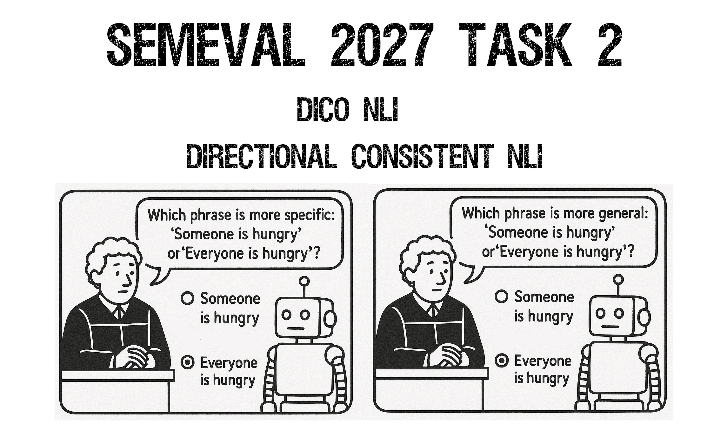

<p align="center" style="overflow: hidden; max-height: 420px;">
  
</p>

# SemEval 2027 Task 2: DiCo-NLI - Directional Consistency in Fine-Grained Natural Language Inference

DiCo-NLI is a multilingual shared task on **directional consistency** in fine-grained natural language inference. Given an ordered pair of phrases, systems predict equivalence, forward entailment, backward entailment, or another semantic relation. Each reversible source pair is evaluated in both directions, enabling joint measurement of classification performance and compatibility with the deterministic label-reversal mapping. The benchmark covers English, Spanish, Basque, and mixed-language settings, with source-pair-level splits that prevent directional and cross-lingual leakage. Official evaluation reports three main scores: Weighted F1, SoftCons, and HardCons.

It aims to evaluate whether NLI systems make **consistent direction-sensitive decisions** over paired phrase instances. Following the spirit of [Berglund et al.'s Reversal Curse work](https://proceedings.iclr.cc/paper_files/paper/2024/hash/5178b2f2d7c44aa390c0777dc77b3f0c-Abstract-Conference.html), the task treats reversal as a controlled stress test for semantic generalization: a system should not only identify the correct relation for an ordered phrase pair, but also produce the compatible relation when the same pair is presented in the opposite direction. The task is inspired by reversal-based evaluation, but it is not a direct test of Berglund-style parametric factual reversal.

**If you use our data, starter kit, or evaluation scripts please cite:**

```bibtex
TODO: add official task citation once available.
```

- **Competition website:** TODO: CodaBench link.
- **Questions or issues:** open a [GitHub issue](../../issues) or email `inigo.lopez@ehu.eus`.
- **Trial data:** [`trial_data/`](trial_data/).
- **Evaluation scripts:** [`evaluation_functions/`](evaluation_functions/).
- **Starter kit:** [`starter_kit/`](starter_kit/).
- **Data release:** final Zenodo archive to be added after the official evaluation phase.
- **Task status:** conditionally accepted for SemEval 2027.

# News

- **2026-07-15:** Sample data ready.
- **2026-07-28:** Starter kit code ready and smoke-tested on the trial data format.
- **2026-09-08:** Final task acceptance notification expected.
- **2026-09-08:** Final/training data release scheduled.

# Task Description

Standard NLI benchmarks usually evaluate whether a model predicts the correct label for a single ordered pair. DiCo-NLI adds a paired requirement: if a model predicts a relation for `(premise, hypothesis)`, its prediction for `(hypothesis, premise)` should be compatible with the logical reversal of that relation.

The task uses short phrase pairs derived from PhrasIS, a fine-grained phrase inference and similarity benchmark built from naturally occurring image captions and news headlines. PhrasIS follows the Interpretable STS annotation lineage: sentence-level STS examples are decomposed into aligned chunks, including noun phrases, verb chains, prepositional phrases, adverbial expressions, and other phrase-level units. DiCo-NLI is therefore phrase-level and compositional in this specific sense: it evaluates inference over semantic units built from smaller lexical and syntactic material, not isolated words and not full sentence pairs.

DiCo-NLI focuses on the reversible subset of PhrasIS:

| Label | Reversed label |
|-------|----------------|
| `EQUIVALENCE` | `EQUIVALENCE` |
| `FORWARD_ENTAILMENT` | `BACKWARD_ENTAILMENT` |
| `BACKWARD_ENTAILMENT` | `FORWARD_ENTAILMENT` |

The official data will also include negative/noise samples from PhrasIS. Any original PhrasIS label outside the reversible set above will be mapped to a single `NEGATIVE_OTHER` label. These items make the classification problem less dependent on a closed reversible-label subset and help test whether systems can separate directional entailment from weaker or unrelated semantic relations.

Example:

| Premise | Hypothesis | Label |
|---------|------------|-------|
| `Everyone is hungry` | `Someone is hungry` | `FORWARD_ENTAILMENT` |
| `Someone is hungry` | `Everyone is hungry` | `BACKWARD_ENTAILMENT` |

This design probes whether models rely on shallow similarity cues or maintain direction-aware semantic structure. A model may be correct on isolated items but inconsistent under reversal; it may also be internally consistent but wrong. DiCo-NLI reports both behaviors explicitly.

The reversible English source subset used in the pilot contains 1,946 source phrase pairs and is close to balanced:

| Gold label | Source pairs | Percentage |
|------------|-------------:|-----------:|
| `EQUIVALENCE` | 686 | 35.3 |
| `FORWARD_ENTAILMENT` | 624 | 32.1 |
| `BACKWARD_ENTAILMENT` | 636 | 32.6 |
| **Total** | **1,946** | **100.0** |

After adding the reversed counterpart for each source pair, the distribution remains balanced at the ordered-instance level: `EQUIVALENCE` maps to itself, while `FORWARD_ENTAILMENT` and `BACKWARD_ENTAILMENT` swap under the reversal operator.

## Data Construction

The repository provides sample/trial data and will provide the complete final task data under documented data folders. The expected structure is:

```text
trial_data/
  README.md
  ...
final_data/
  README.md
  ...
```

The final data documentation will specify label distributions, source provenance, split construction, multilingual translation/adjudication details, and contamination-control notes. The final task data will contain the organizer-provided train, development, and test files for each track.

The official split will be grouped by underlying source phrase pair. For every source pair `(A, B)`, all derived instances will be assigned to the same split: the original ordered item `(A, B)`, the reversed item `(B, A)`, Spanish and Basque translations, and mixed-language variants. This prevents leakage where one direction, language, or variant of a source pair appears in training while another appears in the official evaluation split.

The final evaluation labels will be hidden during the competition and released only after the evaluation phase. We will also document provenance and audit exact or near-exact overlap with examples that appear in papers or public documentation. This does not make the benchmark contamination-free, but it makes the construction protocol explicit and reduces avoidable leakage.

# Tracks

DiCo-NLI will include four tracks.

| Track | Name | Description |
|-------|------|-------------|
| 1 | English | Monolingual English phrase-pair NLI. |
| 2 | Spanish | Monolingual Spanish phrase-pair NLI. |
| 3 | Basque | Monolingual Basque phrase-pair NLI. |
| 4 | Mixed multilingual | Premise and hypothesis may appear in any EN/ES/EU language combination. This track targets cross-lingual directional consistency. |

The English, Spanish, and Basque tracks are independent monolingual tracks. Cross-lingual transfer is evaluated explicitly in the Mixed multilingual track. Participants may submit to any subset of tracks. Results will be reported per track. We will also report a monolingual macro-average over English, Spanish, and Basque, and an all-track macro-average over English, Spanish, Basque, and Mixed multilingual.

The Spanish and Basque data will be produced from the English source items through translation plus bilingual expert verification. Candidate translations will be generated with multiple translation systems, including neural machine translation systems and selected translation-capable LLMs when licensing, cost, and reproducibility constraints permit. Automatic audits will flag exact source/target collapse, duplicated translated pairs, and relation-risk cases before human validation. Verification will check not only translation fidelity, but also whether the directional entailment relation is preserved after translation. Items whose relation is unstable after translation, or whose available translations collapse into trivial same-text pairs, will be corrected or removed from the official split. This filtering also helps make the final benchmark more challenging by removing pairs that become too easy after translation.

For each target language, two bilingual annotators will independently validate a pilot audit of 100 source pairs. The audit will check phrase-level translation adequacy, preservation of the expected NLI label, and preservation of the reversed label after swapping premise and hypothesis. We will report raw agreement, Cohen's kappa, adjudication counts, and translation-induced label-flip rates. For the full release, each translated item will be reviewed by one bilingual annotator, with second-annotator adjudication for low-confidence, ambiguous, or relation-changing cases.

# Evaluation

Systems must predict one label for every ordered phrase pair:

```text
EQUIVALENCE
FORWARD_ENTAILMENT
BACKWARD_ENTAILMENT
NEGATIVE_OTHER
```

The official scorer will report three main evaluation scores:

| Metric | What it measures |
|--------|------------------|
| `Weighted F1` | Standard item-level label-prediction quality, computed as weighted F1 over all labels. |
| `SoftCons` | Directional self-consistency under the reversal operator, independent of gold correctness. |
| `HardCons` | Paired directional correctness under reversal: both directions must be predicted correctly. Because the reversed gold label is deterministic, this is a strict paired-accuracy measure over reversible pairs. |

`NEGATIVE_OTHER` items will be included in the standard label-prediction evaluation. They will not be included in `SoftCons` or `HardCons`, which are defined only over reversible pairs with `EQUIVALENCE`, `FORWARD_ENTAILMENT`, and `BACKWARD_ENTAILMENT` labels.

## Consistency Metrics

`SoftCons` evaluates whether a system is internally consistent under reversal. It ignores the gold label and only checks whether the two predictions made by the same system are compatible with each other.

For example, if a system predicts:

| Premise | Hypothesis | Prediction |
|---------|------------|------------|
| `Everyone is hungry` | `Someone is hungry` | `FORWARD_ENTAILMENT` |
| `Someone is hungry` | `Everyone is hungry` | `BACKWARD_ENTAILMENT` |

then the pair is soft-consistent. The same would be true if the system predicted `EQUIVALENCE` in both directions. In contrast, predicting `FORWARD_ENTAILMENT` in both directions is not soft-consistent, because the reversed counterpart of `FORWARD_ENTAILMENT` is `BACKWARD_ENTAILMENT`.

This metric is useful because a model can be self-consistent even when it is wrong. It separates directional stability from correctness.

For an item `x` and its reversed counterpart `x_rev`, with system prediction function `f` and deterministic label-reversal operator `Rev`:

```text
SoftCons(x) = 1 iff f(x) = Rev(f(x_rev))
```

`HardCons` is stricter. It requires both predictions to match the gold labels. In practice, because the gold label of the reversed item is produced by a deterministic reversal operator, `HardCons` measures whether the system gets both members of the reversible pair correct. It changes the unit of evaluation from isolated ordered instances to complete reversible phrase-pair units.

For example:

| Premise | Hypothesis | Gold label | Prediction |
|---------|------------|------------|------------|
| `Everyone is hungry` | `Someone is hungry` | `FORWARD_ENTAILMENT` | `FORWARD_ENTAILMENT` |
| `Someone is hungry` | `Everyone is hungry` | `BACKWARD_ENTAILMENT` | `BACKWARD_ENTAILMENT` |

This pair receives `HardCons = 1`. If either direction is wrong, or if the two predictions are directionally incompatible, it receives `HardCons = 0`.

The official result for each track will be reported as a three-score profile: `Weighted F1`, `SoftCons`, and `HardCons`. We will not treat one of these as the sole main metric; the task analysis will interpret systems by their joint accuracy, directional self-consistency, and paired-correctness behavior. Any CodaBench display ordering or additional summary field will be preannounced and will not replace the three official scores.

In addition to per-track scores, the task overview will report two secondary aggregate profiles: a monolingual macro-average over English, Spanish, and Basque, and an all-track macro-average over English, Spanish, Basque, and Mixed multilingual. Each aggregate will average the three official scores separately with equal weight per selected track. These aggregates are summaries for analysis and do not replace the per-track official results.

The scorer also returns diagnostic information such as macro-F1, accuracy, per-label precision/recall/F1, confusion matrices, reversible-pair counts, and a bounded list of pair-level errors.

Scores will be reported per track. We also plan to report model metadata in the task analysis, including:

| Metadata | Values |
|----------|--------|
| Access regime | open-weight, commercial/API-based, private/closed, hybrid/ensemble |
| Architecture family | encoder-only, decoder-only, encoder-decoder, other |
| External data use | none, public data, private data |

## Pilot Results

The LREC pilot paper is available at https://lrec.elra.info/lrec2026-main-423. The pilot evaluated encoder-only, decoder-only, and encoder-decoder systems on the English reversal-aware benchmark. Representative results on the positive combined track show that the task is feasible but not saturated:

| Architecture family | Representative model | Weighted F1 | SoftCons | HardCons |
|---------------------|----------------------|----------:|---------:|---------:|
| Encoder-only | DeBERTa v3-base | 0.75 | 0.84 | 0.79 |
| Decoder-only | OPT-125M | 0.61 | 0.65 | 0.58 |
| Encoder-decoder | BART-large | 0.68 | 0.80 | 0.72 |

Family-level means show the same pattern:

| Architecture family | Weighted F1 | SoftCons | HardCons |
|---------------------|----------:|---------:|---------:|
| Encoder-only | 0.713 +/- 0.031 | 0.770 +/- 0.049 | 0.721 +/- 0.048 |
| Decoder-only | 0.583 +/- 0.038 | 0.568 +/- 0.060 | 0.498 +/- 0.070 |
| Encoder-decoder | 0.655 +/- 0.024 | 0.768 +/- 0.025 | 0.693 +/- 0.019 |

# Important Dates and Task Phases

These dates follow the SemEval-2027 preliminary timetable.

| Task | Date |
|------|------|
| ~~Sample data ready~~ | ~~15 July 2026~~ |
| Final task acceptance notification | 8 September 2026 |
| Final/training data ready | 8 September 2026 |
| Evaluation data ready | 1 December 2026, internal deadline, not public release |
| Evaluation start | 10 January 2027 |
| Evaluation end | By 31 January 2027 |
| Paper submission due | February 2027 |
| Notification to authors | March 2027 |
| Camera ready due | April 2027 |
| SemEval workshop | Summer 2027, co-located with a major NLP conference |

# How to Participate

1. Register on the CodaBench competition page once it is available.
2. Choose one or more tracks: English, Spanish, Basque, or Mixed multilingual.
3. Download the trial/final data from this repository once released.
4. Build a system that outputs one label per ordered phrase pair.
5. Validate your submission format with the official scorer/validator in [`evaluation_functions/`](evaluation_functions/).
6. Submit predictions through CodaBench during the evaluation window.
7. Submit a system description paper if you want your run to appear in the official SemEval ranking.

The public repository already includes a lightweight starter kit:

```text
starter_kit/
  README.md
  requirements.txt
  main.py
  SLURM/
  src/
```

The starter kit provides a minimal Hugging Face fine-tuning pipeline, prediction CSV writer, optional official-scorer integration, pinned dependency file, environment setup instructions, and SLURM templates. It is intended to help participants validate the task format and run small local experiments, not to prescribe a required modeling approach.

The official scorer and the starter kit's scorer integration require Python 3.10 or newer.

The trial data bundle currently includes scored random and majority baselines. The starter kit also documents smoke-test commands for representative small neural model families:

| Family | Smoke-test model | Purpose |
|--------|------------------|---------|
| Encoder-only | `distilbert-base-multilingual-cased` | Validate supervised encoder fine-tuning and scoring. |
| Decoder-only | `EleutherAI/pythia-160m` | Validate decoder-only sequence-classification compatibility. |
| Encoder-decoder | `google/mt5-small` | Validate encoder-decoder sequence-classification compatibility. |

These neural commands are smoke tests only. They reuse trial data for technical validation and should not be interpreted as official baselines or model-quality claims.

# Competition Rules and Terms

<details>
  <summary>1. Official ranking</summary>

To be included in the official ranking, teams must submit a system description paper according to SemEval instructions. The official result will be based on the final selected submission for each track and will report the three main scores: `Weighted F1`, `SoftCons`, and `HardCons`. The task overview may also report monolingual and all-track macro-average profiles over these same three scores as secondary summaries.
</details>

<details>
  <summary>2. Submission limits</summary>

Submission limits for development and evaluation phases will be configured on CodaBench and announced before the competition opens.
</details>

<details>
  <summary>3. Data use</summary>

Participants may use external resources unless explicitly restricted in the final rules. All external data, models, prompts, retrieval sources, and training data must be documented in the system description paper.
</details>

<details>
  <summary>4. Test data and gold labels</summary>

Hidden evaluation labels must not be used during system development. Final gold labels will be released after the evaluation phase, together with the official scorer and data documentation.
</details>

<details>
  <summary>5. Public release of scores</summary>

By submitting to the official competition, teams consent to the release of their scores on the competition platform, in the task overview paper, and in SemEval workshop materials.
</details>

<details>
  <summary>6. Model and system reporting</summary>

Teams must report whether their system uses open-weight models, commercial/API-based models, private/closed models, retrieval, external training data, prompt engineering, fine-tuning, or ensembling. This metadata is mandatory for task analysis but will not define separate official leaderboards by default.
</details>

<details>
  <summary>7. Invalid submissions</summary>

Organizers may withhold scores for incomplete, malformed, deceptive, duplicate, or rule-violating submissions.
</details>

<details>
  <summary>8. Dataset disclaimer</summary>

The dataset is provided for scientific research and shared-task evaluation. Organizers and affiliated institutions provide no warranty on dataset completeness or error-free annotation.
</details>

# FAQs

<details>
  <summary>Is DiCo-NLI the same as the original Reversal Curse benchmark?</summary>

No. The original Reversal Curse work tests parametric knowledge reversal: a model trained on `A is B` may fail to retrieve `B is A`. DiCo-NLI is inspired by that problem, but evaluates directional consistency in an NLI setting where both phrases are provided to the system.
</details>

<details>
  <summary>Do I need to participate in all tracks?</summary>

No. Teams may participate in one or more tracks.
</details>

<details>
  <summary>Can I use LLMs?</summary>

Yes. Open-weight, API-based, fine-tuned, prompted, and hybrid systems are allowed unless the final task rules introduce a specific restriction. The system description paper must document the setup.
</details>

<details>
  <summary>Can I train on PhrasIS?</summary>

The final data-use policy will be documented before the training phase. The official release will distinguish task training data from auxiliary resources and will require participants to report any use of PhrasIS or related public datasets. The official evaluation split will be grouped by source phrase pair so that training data does not contain another direction, language, or variant of a final-test pair.
</details>

<details>
  <summary>Is this a compositionality benchmark?</summary>

Only in a specific phrase-level sense. DiCo-NLI evaluates inference over composed phrase meanings inherited from the iSTS/PhrasIS chunk-alignment framework. It is not a controlled benchmark of arbitrary compositional generalization over generated syntactic templates.
</details>

<details>
  <summary>How will the multilingual data be validated?</summary>

Spanish and Basque items will be checked by bilingual annotators. The validation will include a relation-preservation audit: translated pairs must preserve the intended reversible label relation, not only literal translation quality.
</details>

<details>
  <summary>Will final gold labels be released?</summary>

Yes. Final gold labels are expected to be released after the official evaluation phase.
</details>

# Resources

- SemEval-2027 call for task proposals: https://semeval.github.io/SemEval2027/cft
- SemEval FAQ: https://semeval.github.io/faq.html
- Trial data: [`trial_data/`](trial_data/)
- Evaluation scripts: [`evaluation_functions/`](evaluation_functions/)
- Starter kit: [`starter_kit/`](starter_kit/)
- Assessing Logical Consistency in Fine-Grained NLI, LREC 2026 pilot paper: https://lrec.elra.info/lrec2026-main-423
- PhrasIS: Phrase Inference and Similarity benchmark: https://doi.org/10.1093/jigpal/jzae037
- The Reversal Curse: LLMs trained on "A is B" fail to learn "B is A": https://proceedings.iclr.cc/paper_files/paper/2024/hash/5178b2f2d7c44aa390c0777dc77b3f0c-Abstract-Conference.html

# Organizers

| Name | Role | Affiliation | Contact |
|------|------|-------------|---------|
| Inigo Lopez-Gazpio | Lead Organizer | HiTZ Basque Center for Language Technology - Ixa NLP Group, University of the Basque Country UPV/EHU | `inigo.lopez@ehu.eus` |
| Jon F. Apaolaza | Co-Organizer | HiTZ Basque Center for Language Technology - Ixa NLP Group, University of the Basque Country UPV/EHU | `jonfelix.apaolaza@ehu.eus` |
| Aitor Soroa | Advisory Organizer | HiTZ Basque Center for Language Technology - Ixa NLP Group, University of the Basque Country UPV/EHU | `a.soroa@ehu.eus` |
| Rodrigo Agerri | Advisory Organizer | HiTZ Basque Center for Language Technology - Ixa NLP Group, University of the Basque Country UPV/EHU | `rodrigo.agerri@ehu.eus` |
